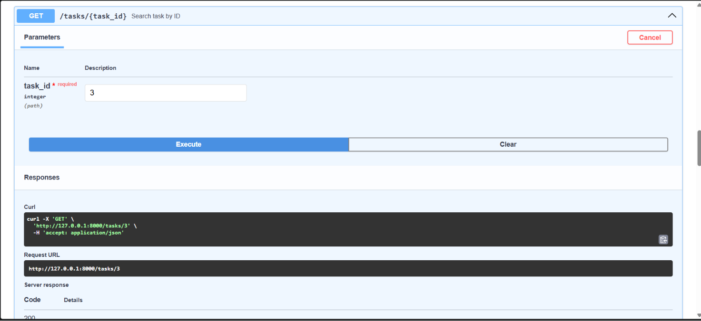
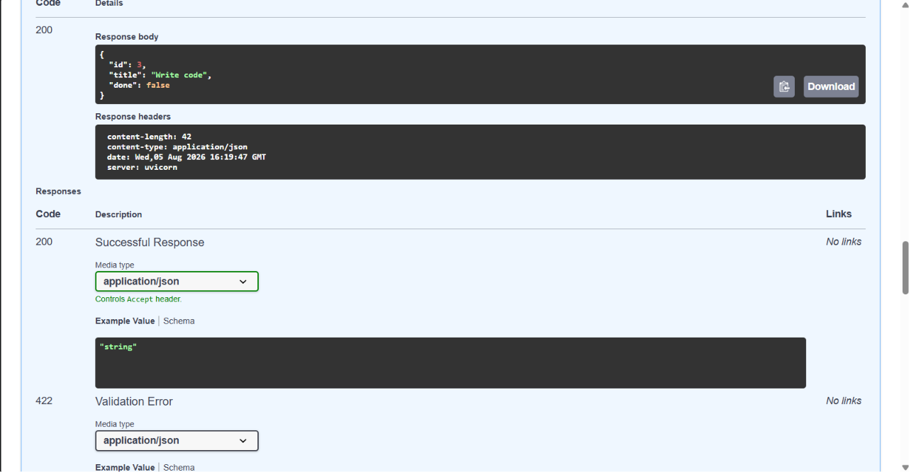

# Task API — CRUD To-Do List

A small in-memory REST API for managing a to-do list, built with FastAPI as part of the FlyRank Internship Backend Track (Week 2, Assignment A1). Supports full CRUD — create, read, update, delete — on tasks, with interactive documentation via Swagger UI.

Data lives in memory only (no database) — it resets every time the server restarts.

## How to install & run

```
git clone https://github.com/haniyakk/flyrank-w2-crud-api.git
cd flyrank-w2-crud-api
python -m venv venv
venv\Scripts\Activate.ps1   # Windows PowerShell — use `source venv/bin/activate` on Mac/Linux
pip install -r requirements.txt
uvicorn main:app --reload
```

The server runs on `http://127.0.0.1:8000`. Interactive docs are available at `http://127.0.0.1:8000/docs`.

## Endpoints

| Method | Path | Description | Success | Errors |
|---|---|---|---|---|
| GET | `/` | API description | 200 | — |
| GET | `/health` | Health check | 200 | — |
| GET | `/tasks` | List all tasks | 200 | — |
| GET | `/tasks/{id}` | Get a single task | 200 | 404 if not found |
| POST | `/tasks` | Create a new task | 201 | 400 if title missing/empty |
| PUT | `/tasks/{id}` | Update a task's title and/or done status | 200 | 400 if title empty, 404 if not found |
| DELETE | `/tasks/{id}` | Delete a task | 204 | 404 if not found |

All error responses (400, 404) use the shape `{"error": "<message>"}`.

## Example — curl

```
curl -i http://127.0.0.1:8000/tasks
```

```
HTTP/1.1 200 OK
date: Wed, 05 Aug 2026 07:47:59 GMT
server: uvicorn
content-length: 127
content-type: application/json

[{"id":1,"title":"Workout","done":false},{"id":2,"title":"Read a book","done":true},{"id":3,"title":"Write code","done":false}]
```

## Swagger UI





## Notes

- Data is stored in memory only — restarting the server resets tasks back to the 3 seed examples. This is intentional for this stage of the assignment (no database yet).

## Me vs AI — a comparison

As part of this assignment I gave an AI (Claude) the exact same spec I built against, without showing it my code, and diffed the two `main.py` files with `git diff --no-index`.
**Here's my prompt**
Hi, today I have a task for you 
The task is to generate an in-memory to-do list [task  CRUD]  CRUD API project 
here are the endpoints required for this project: 
a api description, an api health check, one that searches task by id and gives the details, one that returns all the tasks, one that finds the tasks by id and updates them, one that finds and delete by id, one that creates a task
the tasks will in total have these attributes/ field
id (int), title (string), done (boolean)
when the user is creating a task, they only input the title and one, id is incrementing automatically, when updating they give the id and title OR done is updated 
so if the title isn't updated it shouldn't be bothered and vice versa
when deleting, the whole task is deleted not just an attribute, handle ids appropriately. 
so basically 5 stages 
stage 1: setup
stage 2: read root , and health checkup
the description could be the attributes, and health checkup : status ok 
and read root name: Task , version 1.0, "endpoints": ["/tasks"] }
stage 3: return a task (search by id) and return all tasks
if id not found: {"error": "Task [id] not found " } and in the square braces the id should be written, for return all the tasks no response body no http codes
stage 4: creating task endpoint
http code: 201, response body {"id": [id], "title": "[title]", "done": "[done]"}
stage 5: updating task and deleting tasks
and for updating use the code 200 and return the updated task like you return in the create endpoint, and for delete there is no response body hence code is 204
For 400: return 400 Bad Request when creating a task with a missing or empty/whitespace-only title, or when updating a task with an empty/whitespace-only title. Response body: `{"error": "Title can't be empty"}` (or similar).
http codes to be utilized 200, 204, 201, 404, 400 proper http exceptions should be raised where needed 
all edge cases (empty string, id not found, title not empty rather "  " a space etc etc) 
total endpoints expected: 7 
then comes the response bodies so 

Technologies to be used:
python
fastapi
uvicorn
pydantic 
swagger

**What the AI did better, and why:**
- **Whitespace-only titles on create.** My check was `if not new_task.title or new_task.title is None:` — but `not "   "` evaluates to `False` in Python, since a non-empty string (even one that's all spaces) is truthy. So `POST /tasks` with `{"title": "   "}` slipped past my check and created a task with a blank title, even though my own spec said this should 400. The AI's version calls `.strip()` before checking emptiness, which catches it.
- **Id counter vs. `max()`.** I derived new ids with `max(t["id"] for t in tasks) + 1`. That crashes with `ValueError: max() arg is an empty sequence` the moment every task has been deleted and someone posts a new one. The AI kept a separate `next_id` counter that only ever increments, independent of how many tasks currently exist — so it survives an empty list.
- **Lookup structure.** I stored tasks as a `list` and looped through it (`for task in tasks: if task["id"] == task_id`) for every get/update/delete. The AI used a `dict` keyed by id, so those are O(1) lookups instead of O(n). Doesn't matter for a handful of tasks, but it's the right instinct.

I understand why each of these works — they're straightforward fixes once pointed out, and I could reproduce them from scratch. The `not string.strip()` gap in particular is a good reminder that truthiness checks on strings don't cover whitespace.

**What it got wrong or quietly changed:**
- It started with an **empty task list**, while I seeded mine with 3 example tasks (Workout, Read a book, Write code). My prompt never specified either way — this was a silent design choice on both our parts, not something the AI got wrong against my spec. Worth flagging because it changes what `GET /tasks` returns on a fresh boot, which could matter if a grader's test assumes one or the other.
- It didn't ignore or misapply any status code from my spec — every code (200/201/204/400/404) and every response body shape matched what I asked for when I tested it.

**What my prompt didn't specify — filled in silently by the AI:**
- Project file layout: it split the code into `models.py` (Pydantic schemas) and `main.py` (routes), rather than one file. I hadn't specified single-file vs. split.
- The in-memory data structure (`dict` keyed by id vs. a `list`) — I hadn't specified this either, and it's the source of the O(1) vs O(n) difference above.
- Whether the store starts empty or pre-seeded — genuinely unspecified in my prompt, and each of us defaulted differently.
- It added a `requirements.txt` and its own README, neither of which I'd asked for, but both are reasonable defaults for a runnable project.

**Bugs in my own version, caught by this exercise:**
1. Whitespace-only titles pass validation on `POST /tasks` (should 400).
2. `POST /tasks` after deleting all tasks raises an unhandled 500 instead of assigning id `1`.

I've fixed both in the current version of `main.py`.
